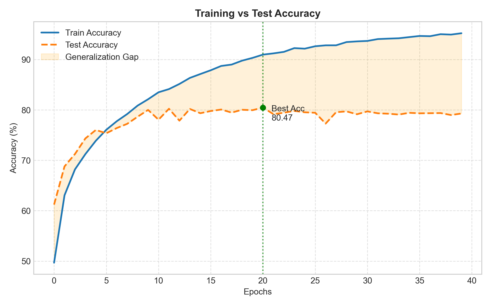
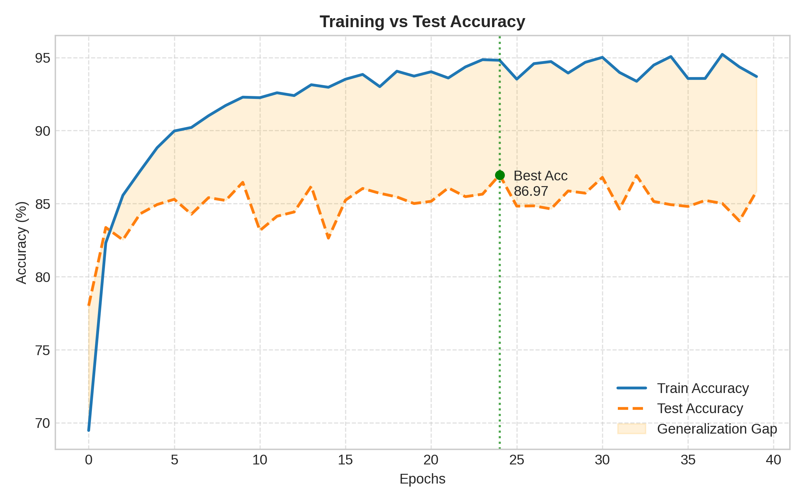
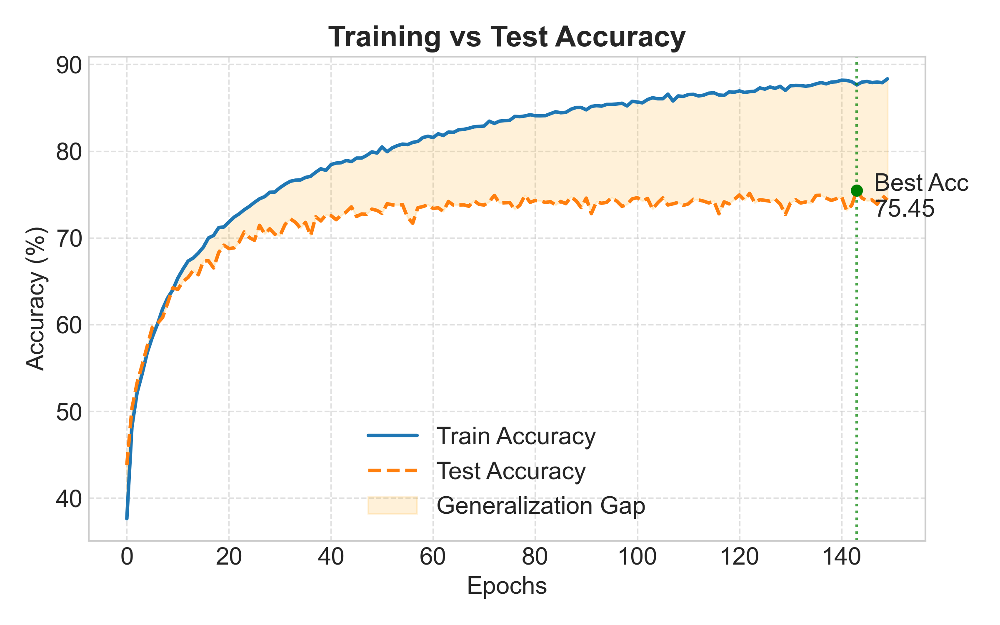
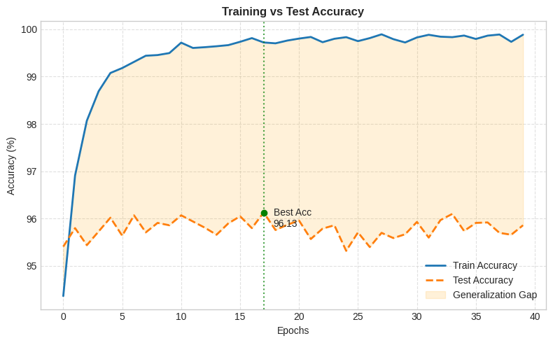

# CNN vs Vision Transformer on CIFAR-10 (PyTorch)

## Overview

This project benchmarks four deep learning architectures for CIFAR-10 image classification using PyTorch, comparing both Convolutional Neural Networks (CNNs) and Vision Transformers (ViTs).

CNNs primarily focus on learning local spatial features such as edges, textures, and shapes through convolution operations, making them highly efficient for smaller image datasets. In contrast, Vision Transformers analyse global relationships between image patches using self-attention mechanisms, enabling stronger contextual understanding and improved feature generalisation.

Models implemented:
- **[ShallowCNN](notebooks\01-cifar-10-custom-cnn.ipynb)** — A lightweight convolutional neural network built from scratch using convolution, batch normalisation, pooling, and dropout layers.
- **VGG16_FineTuned** — An ImageNet pretrained VGG16 model adapted for CIFAR-10 using transfer learning and partial layer fine-tuning.
- **CCompactViT** — A transformer-based architecture developed from scratch using patch embeddings, positional encoding, and self-attention mechanisms.
- **ViT_B16_FineTuned** — A pretrained Vision Transformer fine-tuned on CIFAR-10 by updating the classification head and final transformer block.


The goal of this experiment is to evaluates:
- CNN vs Transformer-based architectures
- Transfer learning effectiveness
- Training efficiency
- Generalisation performance on CIFAR-10


Fine-tuned Pretrained ViT-B/16 achieved over 95% test accuracy on unseen test data within a single epoch, significantly outperforming all other architectures.

## Dataset

CIFAR-10 contains 60,000 colour images across 10 classes:
- airplane
- automobile
- bird
- cat
- deer
- dog
- frog
- horse
- ship
- truck

Input image size:
32×32 RGB images.

---

## Models Implemented

### 🔹 ShallowCNN (From Scratch)

A custom Convolutional Neural Network built as a baseline model.

- 3 convolutional blocks with BatchNorm + ReLU
- MaxPooling for spatial downsampling
- Fully connected classifier with dropout
- Trained entirely from scratch on CIFAR-10
- All parameters are trainable

**Key idea:** Learns visual features directly from dataset without any prior knowledge.

---

### 🔹 VGG16_FineTuned (Transfer Learning)

A pretrained VGG16 model originally trained on ImageNet, adapted for CIFAR-10.

- Pretrained convolutional feature extractor (ImageNet weights)
- Final classification layer replaced for 10 classes
- Most convolutional layers frozen
- Last convolutional block + classifier fine-tuned

**Key idea:** Reuses learned visual features to improve generalisation and reduce training time.

---

### 🔹 CompactViT (ViT – From Scratch)

A transformer-based architecture that processes images as sequences of patches.

- Image split into 4×4 patches
- Patch embeddings passed into transformer encoder
- Self-attention used to model global relationships
- No pretraining used (trained from scratch)
- Fully trainable model

**Key idea:** Learns global dependencies instead of local convolutional features.

---

### 🔹 ViT_B16_FineTuned (Transfer Learning)

A pretrained Vision Transformer fine-tuned for CIFAR-10 classification.

- Pretrained on ImageNet-1K
- Patch-based transformer architecture (16×16 patches)
- Most encoder layers frozen
- Last transformer block + classification head fine-tuned

**Key idea:** Combines large-scale pretraining with task-specific adaptation.

---

## 📊 Model Summary Table

| Model | Architecture Type | Total Parameters | Trainable Parameters | Frozen Parameters | Pretrained | Key Idea |
|------|------------------|------------------|---------------------|------------------|------------|----------|
| ShallowCNN | CNN (from scratch) | Low (~1–2M) | 100% | 0% | ❌ | Learns features directly from CIFAR-10 |
| VGG16_FineTuned (TL) | CNN + Transfer Learning | High (~138M) | ~10–15% | ~85–90% | ✅ ImageNet | Transfers pretrained visual features |
| CompactViT (from scratch) | Transformer | Medium (~5–7M) | 100% | 0% | ❌ | Learns global relationships via patches |
| ViT_B16_FineTuned (TL) | Transformer + Transfer Learning | Very High (~85M+) | ~5–10% | ~90–95% | ✅ ImageNet | Strong transfer learning with attention |

---

## Results

| Model | Train Accuracy | Test Accuracy | Best Epoch |
|------|------|------|------|
| ShallowCNN | 90.98% | 80.47% | 20 |
| VGG16_FineTuned | 94.81% | 86.97% | 24 |
| CompactViT | 87.63% | 75.45% | 144 |
| ViT_B16_FineTuned | 99.72% | 96.13% | 18 |

---
# Sample classification
The following images show sample predictions from the best-performing model (Pretrained ViT-B/16) on unseen test data.


## 📈 Learning Curves (Accuracy vs Epoch)

The following plots show training and validation accuracy across epochs for each model.

### Custom CNN


### VGG16_FineTuned (Transfer Learning)


### CompactViT


### ViT_B16_FineTuned (Transfer Learnoing)


## Key Findings
- Pretrained Vision Transformers achieved the highest accuracy.
- Pretrained Vision Transformers reached more than 95% accuracy on unseen test data in just one epoch.
- Transfer learning significantly outperformed training from scratch.
- Custom ViT required substantially more training epochs.
- ShallowCNN and custom ViT showed signs of overfitting, where training accuracy increased substantially while validation/test accuracy lagged behind.
- Transfer learning significantly reduced overfitting compared to training models from scratch.
- CNN architectures remained computationally efficient for smaller datasets.


## Future Improvements

- Data augmentation experiments
- Hyperparameter optimisation
- Mixed precision training
- EfficientNet comparison
- Grad-CAM visualisation

---

## Project Structure

```text
project/
├── notebooks/
├── results/
├── models/
├── data/
├── README.md
└── requirements.txt
```
---

## Technologies Used

- Python
- PyTorch
- Torchvision
- Matplotlib
- CUDA / GPU Training

---

## Technologies Used

- Python
- PyTorch
- Torchvision
- Matplotlib
- CUDA / GPU Training
## ⚙️ Installation

```bash
# 1. Clone the repository
git clone https://github.com/samanhesari/cnn-vit-experiments
cd cnn-vit-experiments

# 2. Create virtual environment
python -m venv venv

# Activate environment
# Windows:
venv\Scripts\activate
# Mac/Linux:
source venv/bin/activate

# 3. Upgrade pip
pip install --upgrade pip

# 4. Install dependencies
pip install -r requirements.txt

# 5. Install Jupyter Notebook (if not installed)
pip install notebook

# Or install Jupyter Lab
pip install jupyterlab

# 6. Run Jupyter
jupyter notebook
# or
jupyter lab

# 7. Open notebooks in the 'notebooks/' directory to train and evaluate models.
```
## Author

- Name: Saman Hesarizonozi
- Email: samanhessari@gmail.com
- GitHub: https://github.com/samanhesari
- LinkedIn: https://www.linkedin.com/in/saman-hesari-0a2827164/